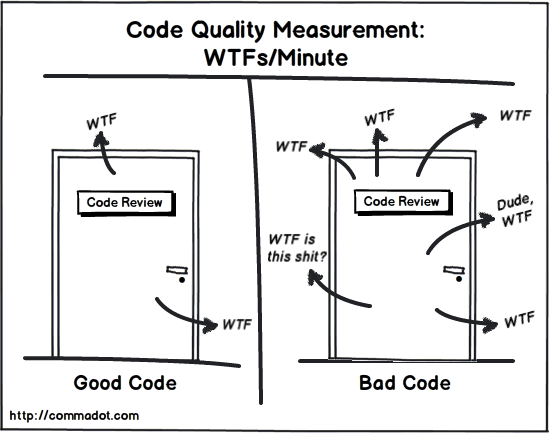

@title[Cover]

@snap[north-west byline]
  Software Development Series
@snapend

@snap[west headline text-white]
  @size[0.75em](@color[orange](T)est @color[orange](D)riven @color[orange](D)evelopment)  
  @size[0.75em](in .NET Core) C#  
@snapend

---

@title[Earth without TDD]

@snap[west headline text-white]
  @size[0.75em](What Would Earth Be Like @color[brown](Without TDD) ?)
@snapend

+++

@title[Mysteries]


+++

@title[Code Quality]



+++

@title[Misunderstanding]


---

@title[TDD Definition]

## [Wikipedia](https://en.wikipedia.org/wiki/Test-driven_development)

@size[0.75em](@fa[quote-left] Test-driven development is a software development process that relies on the repetition of a very short development cycle: @color[orange](requirements are turned into very specific test cases, then the software is improved to pass the new tests, only). This is opposed to software development that allows software to be added that is not proven to meet requirements @fa[quote-right])

---

@title[Requirements to Test cases]

@snap[west headline text-white]
  @size[0.75em](Turn Requirements)  
  @color[orange](@fa[angle-double-right] Test cases)
@snapend

+++

@title[Grouping]

@snap[north headline]
Grouping
@snapend

@snap[midpoint list-content-concise span-100]
@ol
- Normal cases
- Alternative cases
- Exception cases
@olend
@snapend

+++

@title[Example]

## Example

```
Normal cases
1.ผู้ใช้กดเงินออกจากตู้ข้อมูลถูกต้อง ระบบทำการหักเงินแล้วนำเงินออกมา
2.ผู้ใช้กดเงินออกจากตู้แต่เงินในบัญชีไม่พอ ระบบทำการแจ้งเตือน
3.ผู้ใช้กดเงินออกจากตู้ข้อมูลถูกต้อง แต่ตู้มีเงินไม่พอจ่าย ระบบทำการแจ้งเตือน

Alternative cases
4.ผู้ใช้บัญชีพิเศษกดเงินมากกว่าที่มีในบัญชี ระบบบันทึกเครดิตแล้วนำเงินออกมา
5.ผู้ใช้บัญชีพิเศษกดเงินมากกว่าที่มีในบัญชี แต่เครดิตเต็มแล้ว ระบบทำการแจ้งเตือน

Exception cases
6.ผู้ใช้ถอนเงินสำเร็จแต่ระบบไม่สามารถตัดเงินออกจากบัญชีได้ ระบบทำการแจ้งเตือน
```
@[1-4](Normal cases: กรณีที่เจอได้บ่อยๆ 80~90%)
@[6-8](Alternative cases: กรณีที่นานๆจะเกิดขึ้นที หรือเคสขอบ)
@[10-11](Exception cases: กรณีข้อผิดพลาดที่ยอมรับไม่ได้)

---

@title[Test cases to Testable code]

@snap[west headline text-white]
  @size[0.75em](Turn Test cases)  
  @color[orange](@fa[angle-double-right] Testable code)
@snapend

+++?image=assets/img/bg/orange.jpg&position=right&size=50% 100%

@title[xUnit]

@snap[west split-screen-heading span-50]
[xUnit Framework](https://xunit.github.io)  

@snapend

@snap[east text-white span-50]
@ol[split-screen-list](false)
- Install [.NET Core SDK](https://www.microsoft.com/net/download)
- Open Command Prompt
- Type the cmd below
@size[0.5em](dotnet new xunit -n demoexunit)
@snapend

+++

@title[Fact & Theory]

### Fact & Theory Attributes

```
[Fact]
public void TestMethod1()
{
    // Do something
}

[Theory]
[InlineData(1)]
[InlineData(9)]
public void TestMethod2(int input)
{
    // Do something
}
```
@[1-2](Fact Attribute: ใช้ทดสอบสิ่งที่เป็นจริงเสมอ และ method นั้นจะรับ parameters ไม่ได้)
@[7-10](Theory Attribute: ใช้ทดสอบ test cases หลายๆแบบ และ method สามารถมี parameters ได้)

+++

@title[Demo]

@snap[west headline]
  @size[1.5em](@color[orange](@fa[laptop]) Demo)  
  ATM's scenarios
@snapend

---

@title[TDD Mantra]

@snap[west split-screen-heading span-60]
@size[0.75em](The Mantra of TDD)  

@snapend

@snap[east text-white span-40 fragment]
@ol[split-screen-list](false)
@size[0.5em](@fa[quote-left] TDD is a software development process which consists of writing unit test that will **initially fail** and then implementing minimum amount of code to **pass** that test to @color[yellow](**avoiding over engineer**) @fa[quote-right])
@snapend

---

@title[TDD vs Traditional Testing]

### TDD vs Traditional Testing

||TDD|Traditional|
|--|--|--|
|Strategy|Test First|Code First|
|Code covered with tests|> 90%|@fa[question]|
|When to write tests|Now|@fa[question]|
|Short term|@fa[angle-double-down]|@fa[rocket]|
|Long term|@fa[rocket]|@fa[angle-double-down]|

---

@title[Refactoring]

@snap[west split-screen-heading span-60]
Refactoring  

@snapend

@snap[east text-white span-40]
@ol[split-screen-list]
* Is the existing design the best design possible?
* If not, refactor the code until it is easier to add new feature
<div class="fragment">@color[orange](@fa[question-circle] We have a lot of work to do!! Can we skip it?)</div>
@snapend

---

@title[Enterprise app development]

## Enterprise app development

+++?image=assets/img/bg/orange.jpg&position=right&size=50% 100%

@title[App's Concerns]

@snap[west split-screen-heading span-50]
App's Concerns
@snapend

@snap[east text-white span-50]
@ol[split-screen-list](false)
* Maintainable code
* Sharable code
* Scalable 
@fa[question-circle] None-functional requirements
@snapend

+++?image=assets/img/bg/orange.jpg&position=right&size=50% 100%

@title[None-function requirements]

@snap[west split-screen-heading span-50]
@size[0.75em](None-function requirements)
@snapend

@snap[east text-white span-50]
@ol[split-screen-list](false)
* Scalable
* Security
* Privacy
* Readability
@snapend

+++

@title[Who writes the tests?]

@snap[west headline text-white]
  @size[0.75em](Who writes the tests?)  
  @color[brown](@fa[heartbeat] The whole TEAM)
@snapend

---

@title[Number of Tests]

## Number of Tests

@snap[midpoint-west text-white]
@ol[split-screen-list](false)
- Acceptance tests
- Functional tests
- Integration tests
- Unit tests
@snapend

---
@title[Quote]

@snap[north-east span-60]
@quote[We cannot solve our problems with the same thinking we used when we created them.]
@snapend

@snap[east text-blue span-50]
@quote[Houston, Tranquillity Base here. The Eagle has landed.](Neil Armstrong)
@snapend

@snap[south-east span-50]
@quote[GitPitch Desktop with speaker notes is AMAZING!](Dave T.)
@snapend

@snap[north-west]
<br>
@quote[GitPitch is just WONDERFUL!](Mohammed A.)
@snapend

@snap[south-west span-20]
@quote[Just discovered GitPitch. And WOW!](Adrian K.)
@snapend

---?image=assets/img/bg/orange.jpg&position=right&size=50% 100%
@title[Split-Screen-1]

@snap[west split-screen-heading text-orange span-50]
Topics to be covered today
@snapend

@snap[east text-white span-45]
@ol[split-screen-list](false)
- Lorem ipsum dolor sit amet, consectetur elit
- Ut enim ad minim veniam, quis exercitation
- Duis aute irure dolor in reprehenderit in voluptate
@olend
@ul[split-screen-list](false)
- Lorem ipsum dolor sit
- Lorem ipsum dolor sit
@ulend
@snapend

+++?image=assets/img/bg/black.jpg&position=left&size=50% 100%

@title[Split-Screen-Image]

@snap[west split-screen-byline text-white]
Lorem ipsum<br>sit dolor amet, consectetur elit.
@snapend

@snap[midpoint split-screen-img fragment]

@snapend

@snap[east split-screen-text text-black]
Excepteur sint occaecat cupidatat non proident, sunt in culpa qui officia deserunt mollit anim id est laborum.
@snapend

---

@title[End]

@snap[west headline span-100]
Thank you ;)  
@snapend

@snap[south-west byline text-white]
@fa[comments] Leave your questions below
@snapend

@snap[south-east byline text-white]
@fa[graduation-cap] See all courses [@Saladpuk.com](http://www.saladpuk.com)
@snapend